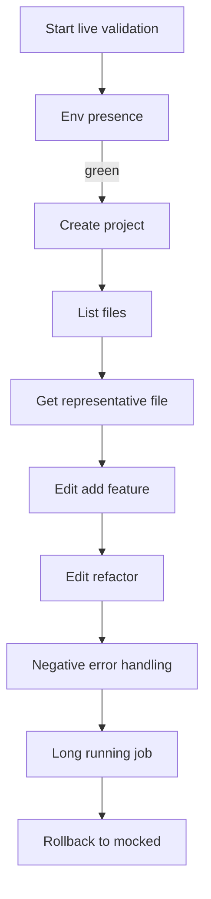

# Live Validation Suite — 2025-11-14T17:14Z

Purpose
- Define a staged, live end-to-end validation suite that runs the real worker container (USE_DUMMY_WORKER=False), verifies artifacts, captures evidence, and gates progression stage-by-stage.
- Deliver this plan for approval prior to implementation; after approval, implement scripts, run sequentially, collect evidence, and update docs.

References
- Backend runner: [run_codex_job()](backend/app/services/codex_runner.py:95), [dummy_worker_generate_snake_game()](backend/app/services/codex_runner.py:29)
- Live worker entrypoint: [main()](worker/run_codex_job.py:138), [generate_initial()](worker/run_codex_job.py:34), [apply_edit()](worker/run_codex_job.py:108)
- API routes: projects (backend/app/api/routes/projects.py), files (backend/app/api/routes/files.py), jobs (backend/app/api/routes/jobs.py)
- Evidence guidance: [docs/evidence/README.md](docs/evidence/README.md)
- Prior test matrix reference: [docs/plans/test-matrix-2025-11-14T12-39Z.md](docs/plans/test-matrix-2025-11-14T12-39Z.md)

Scope
- Live mode only for the scenario ladder defined here; mocked-mode references are for rollback validation.
- No refactors beyond what is necessary to validate the live path and capture evidence safely.

1) Objectives and Acceptance

Objectives
- Design a tiered set of live scenarios from simple generation through edits, refactor, negative handling, and a long-running path.
- Specify inputs, expected outputs, verification steps, evidence artifacts, and rollback instructions.
- Provide debugging guidance for inspecting worker logs, workspace contents, and .codex/result.json.
- Gate each stage on green status before proceeding to the next.

Acceptance Criteria (suite-level)
- Each scenario writes .codex/result.json with coherent status and summary; no secrets are logged or stored.
- Scripts automatically capture required evidence under docs/evidence/<timestamp>/live/<scenario>/.
- Sequential gating enforced: next scenario runs only if prior scenario passes.
- Rollback to mocked mode verified at the end; smoke re-run passes.

Exit Criteria
- Plan approved and checked in.
- Scripts implemented and used to run the suite.
- All scenarios executed with evidence captured; failures documented with remediation steps.
- README and DEV_GUIDE updated with reproducible instructions.

2) Prerequisites and Environment

Environment Toggles
- .env: USE_DUMMY_WORKER=False, CODEX_WORKER_IMAGE points to a built and locally available image (e.g., codex-worker:latest).
- .env.live: contains OPENAI_API_KEY, OPENAI_ORG_ID, OPENAI_PROJECT. Not committed; never printed.

Backend and Docker
- Backend container must be able to run docker: /var/run/docker.sock mounted, docker CLI available.
- The runner [run_codex_job()](backend/app/services/codex_runner.py:95) will execute docker run with:
  - -v <workspace>:/workspace
  - -e OPENAI_API_KEY -e OPENAI_ORG_ID -e OPENAI_PROJECT
- Worker must read .codex/request.json and write .codex/result.json. See [main()](worker/run_codex_job.py:138).

Secrets Hygiene
- Presence-only logging in worker: the logs field in result.json can indicate present or absent for OPENAI_*; never values.
- Never commit .env or .env.live; ensure .gitignore covers both.

Readiness
- docker-compose build and up
- API available at http://localhost:8000/docs (or alternate port if configured)

3) Scenario Ladder (Live Mode)

Legend
- Evidence root: docs/evidence/<ISO8601Z>/live/<ScenarioID>/
- Each scenario stores response.json (primary call), project_id.txt (first create), result.json, result_excerpt.txt; plus files.json or file.json as applicable.

L01 — Worker Environment Presence
- Purpose: Confirm worker container runs and presence-only env lines are emitted to result.json logs.
- Input: POST /api/v1/projects/ with a standard instruction.
- Steps:
  1) Create project via API.
  2) Poll GET /api/v1/<pid>/files/.codex/result.json until 200.
- Expected:
  - result.json exists with logs containing:
    - OPENAI_API_KEY=present|absent, OPENAI_ORG_ID=present|absent, OPENAI_PROJECT=present|absent
  - No secret values appear.
- Evidence:
  - L01/response.json, L01/project_id.txt, L01/result.json, L01/result_excerpt.txt
- Debug: Backend logs should show docker run invocation by [run_codex_job()](backend/app/services/codex_runner.py:95).

L02 — Simple CLI Scaffold
- Purpose: Verify initial project generation path writes minimal Python CLI assets.
- Input: Same project created in L01 (reuse project_id).
- Steps:
  1) Read L01 result.json.
  2) GET /api/v1/<pid>/files to list artifacts.
- Expected:
  - .codex/request.json and .codex/result.json present.
  - Project files may include README.md, app.py, tests/test_cli.py as produced by [generate_initial()](worker/run_codex_job.py:34).
- Evidence:
  - L02/response.json (copy from L01), L02/result.json, L02/result_excerpt.txt, L02/files.json
- Debug: If missing files, inspect host workspace backend/workspaces/<pid>.

L03 — File Listing Verification
- Purpose: Redundant but explicit verification of list-files endpoint in live mode.
- Input: project_id from L01.
- Steps: GET /api/v1/<pid>/files.
- Expected: Includes .codex/request.json, .codex/result.json; any generated content from live worker.
- Evidence: L03/files.json

L04 — Representative File Fetch
- Purpose: Validate per-file retrieval of generated code.
- Input: project_id from L01.
- Steps: GET /api/v1/<pid>/files/app.py
- Expected: 200; non-empty contents.
- Evidence: L04/app.json, L04/status.txt (HTTP status).

L05 — Edit: Add Feature
- Purpose: Confirm edit job modifies workspace deterministically.
- Input: POST /api/v1/<pid>/jobs with {"job_type":"edit","instruction":"Append a comment line to app.py describing the change."}
- Steps:
  1) Submit edit job.
  2) Poll .codex/result.json.
- Expected:
  - result.json shows modified_files includes app.py (by [apply_edit()](worker/run_codex_job.py:108)).
  - No secrets; coherent summary.
- Evidence:
  - L05/response.json, L05/result.json, L05/result_excerpt.txt

L06 — Edit: Refactor Logic
- Purpose: Exercise a slightly more complex edit instruction.
- Input: POST /api/v1/<pid>/jobs with job_type=edit and instruction to refactor fibonacci to iterative with input guard and docstring note.
- Steps:
  1) Submit refactor instruction.
  2) Poll .codex/result.json.
  3) GET /files/app.py to inspect changes.
- Expected:
  - result.json modified_files includes app.py.
  - app.py contains updated logic or at least an appended refactor note if the live worker is minimal.
- Evidence:
  - L06/response.json, L06/result.json, L06/result_excerpt.txt, L06/app.json
- Debug: If no modifications, record as structured limitation; proceed only if status is success or a clear, captured error.

L07 — Negative and Error Handling
- Purpose: Validate controlled failure path and resilience.
- Input: POST /api/v1/projects/ with "force_error" in instruction to trigger error handling in [main()](worker/run_codex_job.py:138).
- Steps:
  1) Create project with force_error hint.
  2) Poll .codex/result.json.
- Expected:
  - result.json.status="error"
  - errors includes "forced_error"
  - API remains responsive.
- Evidence:
  - L07/response.json, L07/project_id.txt, L07/result.json, L07/result_excerpt.txt, L07/notes.txt

L08 — Long-running Job
- Purpose: Validate behavior under longer execution; ensure polling and stability.
- Input: POST /api/v1/projects/ with an instruction like "long_run: generate and analyze a large codebase" OR worker-controlled delay if implemented.
- Steps:
  1) Create project.
  2) Poll .codex/result.json with extended timeout (e.g., 5–10 minutes).
- Expected:
  - Either success with coherent summary and artifacts or structured error without crashing the system.
  - Logs remain presence-only for secrets.
- Evidence:
  - L08/response.json, L08/project_id.txt, L08/result.json, L08/result_excerpt.txt, optional L08/files.json
- Implementation Note:
  - If needed for deterministic validation, we will add an optional env SLEEP_SECONDS to the worker to simulate a long run without external dependencies, then update [main()](worker/run_codex_job.py:138).

4) Gating and Run Order

Policy
- Strict progression; do not run next scenario until current is green.
- On FAIL:
  - Capture evidence, add notes.txt with observed behavior and suspected root cause.
  - Attempt remediation; rerun scenario; only proceed after PASS.

Run Sequence
- L01 → L02 → L03 → L04 → L05 → L06 → L07 → L08 → Rollback smoke (mocked M01–M04)

Mermaid

5) Evidence Requirements

Storage
- Use UTC ISO-8601 Z timestamp per run: docs/evidence/<timestamp>/live/<ScenarioID>/
- Required per scenario (as applicable):
  - response.json, project_id.txt, result.json, result_excerpt.txt
  - files.json for list endpoints, app.json or file.json for representative file
  - notes.txt for deviations or setup details

Redaction
- Never store secrets; redact any accidental value with [REDACTED].
- Presence-only logging policy must hold in result.json logs.

Reference
- Follow [docs/evidence/README.md](docs/evidence/README.md) for filenames and jq excerpts.

6) Verification Checklist (per scenario)

- HTTP status as expected (200 for success; error scenarios must produce structured error).
- .codex/result.json present and parseable.
- status in {"success","error"} with a coherent summary.
- created_files and modified_files align with scenario expectations.
- Logs include OPENAI_* presence lines and exclude values.
- Files endpoints return expected content; non-empty for app.py when applicable.

7) Debugging and Inspection

Worker and Backend
- Tail backend logs (container name may differ):
  - docker-compose logs -f backend
- Expected to see docker run by [run_codex_job()](backend/app/services/codex_runner.py:95).
- Optional enhancement during troubleshooting: run worker with a temporary name to fetch docker logs for that job.

Workspace
- Host inspection:
  - ls -la ./backend/workspaces/<project_id>/
  - cat ./backend/workspaces/<project_id>/.codex/result.json

API
- Swagger: http://localhost:8000/docs
- Representative curl:
  - Create: POST /api/v1/projects/
  - Files: GET /api/v1/<pid>/files
  - File: GET /api/v1/<pid>/files/app.py
  - Edit: POST /api/v1/<pid>/jobs

8) Rollback Procedure (Authoritative)

Steps
- Edit .env: set USE_DUMMY_WORKER=True
- docker-compose build
- docker-compose up
- Verify via Swagger and re-run mocked M01–M04 smoke (with evidence under docs/evidence/<timestamp>/mocked/RERUN/)

Evidence
- live/L07 or L08/notes.txt detailing rollback trigger
- mocked/RERUN/summary.txt confirming M01–M04 success

9) Automation Plan (to be implemented after approval)

Scripts
- Reuse and extend tools/http/live.sh for L01–L06 and add coverage for L07–L08.
- Add a driver: tools/http/live_suite/run_all.sh orchestrating scenarios with gating and exit-on-fail.
- Optional Python driver for richer polling and structured logging.

Behavior
- Parameterize BASE_URL and OUTROOT; default OUTROOT=docs/evidence.
- Compute TS=$(date -u +%FT%TZ) once; place artifacts under docs/evidence/$TS/live/<ScenarioID>/.
- Implement write_excerpt using jq for result_excerpt.txt as in tools/http/live.sh.
- Ensure scripts never echo or read secrets.

Documentation Updates
- README.md: Add Live Validation Suite section with prerequisites and how to run the suite.
- DEV_GUIDE.md: Add worker env passthrough notes, presence-only logging, and remediation tips.

10) Risks and Controls

- Secret leakage
  - Controls: presence-only logs; evidence redaction; .gitignore for .env and .env.live.
- Worker instability
  - Controls: capture structured errors; do not crash the backend; document remediation.
- Long-running behavior variability
  - Controls: optional SLEEP_SECONDS in worker for deterministic delay; extended polling with timeout and clear failure mode.
- Filesystem access
  - Controls: rely on hardened file APIs in the backend; verify .codex accessibility and no escapes.

11) Scenario Acceptance Summary

- L01: result.json logs include presence lines; no secret values.
- L02–L04: .codex artifacts present; representative file returns non-empty contents.
- L05–L06: result.json indicates modified_files and app.py reflects change or clear limitation noted.
- L07: status=error with errors including forced_error; API stable.
- L08: completes with success or structured error within configured timeout; no crashes or leaks.
- Rollback: mocked smoke M01–M04 pass.

12) Implementation Notes and Guardrails

- Runner command in [run_codex_job()](backend/app/services/codex_runner.py:95) already sets -e OPENAI_*; worker logs presence via [main()](worker/run_codex_job.py:138).
- The minimal live worker writes deterministic CLI assets in [generate_initial()](worker/run_codex_job.py:34) and appends edits in [apply_edit()](worker/run_codex_job.py:108).
- If a scenario depends on unimplemented worker behavior:
  - Capture evidence of limitation.
  - File a follow-up and document workaround or scope adjustment.

13) Approval Gate

- Upon approval of this plan, proceed to:
  1) Implement scripts under tools/http/live_suite/ plus any extensions to tools/http/live.sh.
  2) Update README and DEV_GUIDE with the Live Validation Suite instructions.
  3) Run the full live suite sequentially; collect and commit evidence (without secrets).
  4) Execute rollback and mocked smoke re-run.

Appendix A — API Endpoints
- POST /api/v1/projects/
- GET /api/v1/{project_id}/files
- GET /api/v1/{project_id}/files/{path}
- POST /api/v1/{project_id}/jobs

Appendix B — Evidence Filenames
- response.json, project_id.txt, result.json, result_excerpt.txt, files.json, file.json (or app.json), notes.txt

Appendix C — Troubleshooting Quick Tips
- 307 on POST /projects: use trailing slash /projects/ (documented in README)
- Port conflicts: change docker-compose to 8001 and update BASE_URL
- DB migrations: ensure backend applied Alembic at startup