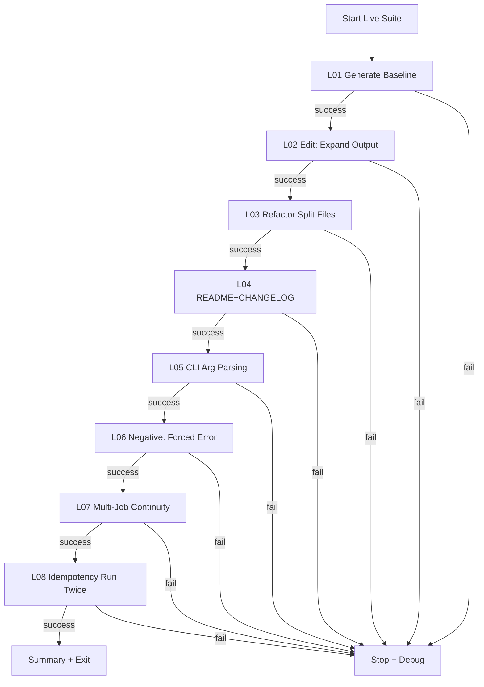

# Live Validation Suite — Real Worker (USE_DUMMY_WORKER=False) — 2025-11-14T18:46Z

Purpose
- Design and implement a staged, live end-to-end validation suite that progressively exercises the Codex CLI worker from baseline project generation through multi-step edits, refactors, negative/error paths, and idempotency checks.
- Each stage must:
  - Run the real worker container (not the dummy worker).
  - Validate via API and filesystem.
  - Capture standardized evidence.
  - Gate progression: no next stage until the current one is green.

Scope
- Live mode only (USE_DUMMY_WORKER=False).
- Scripts and/or a Python driver under tools/http/live_suite/ to automate L01…L08(+).
- Documentation updates (README.md, DEV_GUIDE.md) and evidence in docs/evidence/<timestamp>/live/<scenario>/.

References (context bundle)
- Backend runner: [run_codex_job()](backend/app/services/codex_runner.py:95)
- Worker entrypoint: [main()](worker/run_codex_job.py:138)
- Compose: [docker-compose.yml](docker-compose.yml)
- Evidence guide: [docs/evidence/README.md](docs/evidence/README.md)
- Base live runner (current subset): [tools/http/live.sh](tools/http/live.sh:1)
- Suite orchestrator (current subset): [tools/http/live_suite/run_all.sh](tools/http/live_suite/run_all.sh:1)
- Test matrix (prior plan): [docs/plans/test-matrix-2025-11-14T12-39Z.md](docs/plans/test-matrix-2025-11-14T12-39Z.md)
- Full validation plan (prior): [docs/plans/full-implementation-validation-and-testing-2025-11-14T12-35Z.md](docs/plans/full-implementation-validation-and-testing-2025-11-14T12-35Z.md)

Environment and Preconditions
- Toggle to live mode:
  - .env → USE_DUMMY_WORKER=False
  - .env or .env.live → CODEX_WORKER_IMAGE=codex-worker:latest (or specific tag)
- Secrets availability:
  - .env.live present with OPENAI_API_KEY, OPENAI_ORG_ID, OPENAI_PROJECT populated (presence-only checks; never printed).
  - .gitignore must ignore .env and .env.live (verified).
- Backend container must be able to run docker:
  - docker CLI present in backend image
  - /var/run/docker.sock mounted (see [docker-compose.yml](docker-compose.yml:17))
- Workspaces volume mapping:
  - Host ./backend/workspaces → backend container:/app/workspaces (see [docker-compose.yml](docker-compose.yml:15))
  - Worker is run via docker from backend; it reuses the backend’s volumes using --volumes-from codex-backend; WORKSPACE_DIR must point to /app/workspaces/<project_id> for the worker process (see [run_codex_job()](backend/app/services/codex_runner.py:95))
- API base URL: http://localhost:8000 (or http://localhost:8001 if port remapped)
- Tools required on host for scripts: bash, curl, jq

Evidence Conventions
- Root per run: docs/evidence/<ISO8601Z>/live/
- Per scenario: L01/, L02/, … with:
  - response.json (primary API response)
  - project_id.txt (where applicable)
  - files.json (for list endpoints)
  - file.json or app.json (representative file return)
  - result.json (full contents of .codex/result.json; ensure unwrap if API returns wrapper)
  - result_excerpt.txt (status, summary, created_files, modified_files, first_error)
  - logs.txt (optional tail of backend logs for that scenario; no secrets)
  - notes.txt (optional annotations)

Mermaid Overview (execution flow)

Gating and Return Codes
- Each scenario validates precise acceptance criteria.
- On first failure, the orchestrator stops, writes FAIL message, and exits non-zero. Evidence and logs are still captured to facilitate debugging.
- Upon fix, re-run from the failed scenario or re-run full suite.

Debugging Guidance
- Where to look:
  - Backend logs: docker logs codex-backend
  - Worker invocation: [run_codex_job()](backend/app/services/codex_runner.py:95) — verify docker run command, --volumes-from codex-backend, and WORKSPACE_DIR path.
  - Worker behavior: [main()](worker/run_codex_job.py:138)
    - Presence-only secret logs (OPENAI_*=(present|absent))
    - Error triggers: instruction including "force_error"
    - File write helpers and result.json shape
- Typical issues and resolutions:
  - Missing result.json: confirm proper WORKSPACE_DIR (container path) and that .codex/request.json exists before worker runs. Validate that worker writes to WORKSPACE/.codex/result.json.
  - Permission or volume mismatch: ensure backend mounts ./backend/workspaces → /app/workspaces and worker uses --volumes-from codex-backend.
  - 307 redirect on POST /projects: use trailing slash /api/v1/projects/.
  - Secrets leak in logs: update worker to redact; evidence scripts must redact any accidental values prior to saving.
- Rollback reference:
  - To restore mocked mode: set USE_DUMMY_WORKER=True in .env, docker-compose build, docker-compose up. Verify via Swagger /docs and run smoke.

Scenario Ladder (L01…L09)
- Note: This ladder supersedes earlier L01–L08 mapping in tools/http/live.sh and tools/http/live_suite/run_all.sh. We will implement new per-scenario scripts aligned with the ladder below. The existing live.sh/run_all.sh can be leveraged or replaced by a Python driver.

L01 — Generate CLI Fibonacci Project (baseline scaffold)
- Purpose: Establish baseline project generation in live mode.
- Input instruction:
  - "Generate a minimal Python CLI project that prints the first 10 Fibonacci numbers and includes a basic test."
- Preconditions:
  - Backend up, USE_DUMMY_WORKER=False, worker image built, secrets present (presence-only).
- Steps:
  1) POST /api/v1/projects/ with the instruction.
  2) Extract project_id.
  3) Poll GET /api/v1/{project_id}/files/.codex/result.json until 200; unwrap contents if wrapped.
  4) GET /api/v1/{project_id}/files to list workspace.
- Expected artifacts:
  - .codex/request.json, .codex/result.json
  - README.md, app.py, tests/test_cli.py
- Acceptance:
  - result.json.status in {success, error} with coherent summary.
  - If success: created_files includes README.md, app.py, tests/test_cli.py.
  - result.json.logs include presence-only lines for OPENAI_*
- Evidence:
  - response.json, project_id.txt, result.json, result_excerpt.txt, files.json
- Rollback: N/A
- Debug hints:
  - Check presence-only logs in result.json.
  - If missing result.json, inspect backend logs and verify WORKSPACE_DIR mount path in [run_codex_job()](backend/app/services/codex_runner.py:95).

L02 — Edit to Increase Output (first 15 numbers)
- Purpose: Exercise edit job path and verify modified_files.
- Input instruction:
  - "Modify the CLI to print the first 15 Fibonacci numbers."
- Preconditions:
  - L01 green; reuse project_id from L01 to ensure file continuity.
- Steps:
  1) POST /api/v1/{project_id}/jobs with {"job_type":"edit","instruction":"Modify the CLI to print the first 15 Fibonacci numbers."}
  2) Poll .codex/result.json.
  3) GET app.py; confirm code reflects 15-length behavior (e.g., prints/computes 15).
- Expected artifacts:
  - result.json.modified_files includes app.py (and possibly README.md if worker updates docs).
- Acceptance:
  - API 200; result.json exists; status in {success, error}.
  - If success: modified_files contains app.py; app.py contents reflect 15 elements logic.
- Evidence:
  - response.json, result.json, result_excerpt.txt, app.json
- Rollback: N/A
- Debug hints:
  - If modified_files empty, verify worker edit logic in [main()](worker/run_codex_job.py:138) and ensure it appends or rewrites deterministically.

L03 — Refactor: Split app.py into fibonacci.py + app.py import
- Purpose: Validate multi-file creation and import graph.
- Input instruction:
  - "Refactor by moving fibonacci() to fibonacci.py and have app.py import and use it."
- Preconditions:
  - L02 green; same project_id.
- Steps:
  1) POST edit job with refactor instruction.
  2) Poll .codex/result.json.
  3) GET /files/fibonacci.py and /files/app.py.
- Expected artifacts:
  - New file fibonacci.py; app.py imports from fibonacci module.
- Acceptance:
  - result.json.created_files includes fibonacci.py (if newly created).
  - app.py contains "from fibonacci import fibonacci" or equivalent import; fibonacci.py defines fibonacci().
- Evidence:
  - response.json, result.json, result_excerpt.txt, app.json, fibonacci.json
- Rollback: N/A
- Debug hints:
  - If import fails, ensure filename and import casing; validate created_files/modified_files lists for completeness.

L04 — README Enhancements and CHANGELOG addition
- Purpose: Validate textual edits and new documentation file.
- Input instruction:
  - "Enhance README with usage instructions and create CHANGELOG.md with initial entry."
- Preconditions:
  - L03 green.
- Steps:
  1) POST edit job to update README and add CHANGELOG.md.
  2) Poll .codex/result.json.
  3) GET /files/README.md and /files/CHANGELOG.md.
- Expected artifacts:
  - README.md modified; CHANGELOG.md created.
- Acceptance:
  - result.json.created_files includes CHANGELOG.md; modified_files includes README.md.
  - README contains a "Usage" or "How to run" section; CHANGELOG contains a dated entry.
- Evidence:
  - response.json, result.json, result_excerpt.txt, readme.json, changelog.json
- Rollback: N/A
- Debug hints:
  - Text validation can be lenient (presence of markers/keywords). Ensure no secrets are present in textual logs.

L05 — Add CLI Input Parsing (accept N from CLI)
- Purpose: Extend functionality to accept a runtime parameter and validate behavior markers.
- Input instruction:
  - "Add CLI argument parsing so the program accepts N and prints the first N Fibonacci numbers."
- Preconditions:
  - L04 green.
- Steps:
  1) POST edit job with parsing instruction.
  2) Poll .codex/result.json.
  3) GET app.py; verify parsing code (argparse or sys.argv).
- Expected artifacts:
  - app.py modified with CLI parsing; README updated may be optional but encouraged.
- Acceptance:
  - modified_files contains app.py; code includes argparse or sys.argv usage.
  - Optional: README reflects usage with N parameter.
- Evidence:
  - response.json, result.json, result_excerpt.txt, app.json, optional readme.json
- Rollback: N/A
- Debug hints:
  - Confirm deterministic modification (avoid noisy diffs). If worker writes templates, keep idempotency in mind for L08.

L06 — Negative Path: Forced Error Handling
- Purpose: Validate structured error surface in result.json and resilience.
- Input instruction:
  - "force_error: provoke a controlled failure"
- Preconditions:
  - Backend still stable; may reuse or create a fresh project (fresh recommended).
- Steps:
  1) POST /api/v1/projects/ with the forced error instruction.
  2) Poll .codex/result.json.
- Expected artifacts:
  - result.json.status="error"; errors includes "forced_error"; summary explains the cause.
- Acceptance:
  - API 200; result.json present; structured error captured; system remains responsive.
- Evidence:
  - response.json, project_id.txt, result.json, result_excerpt.txt, notes.txt
- Rollback: N/A
- Debug hints:
  - Error path is implemented in [main()](worker/run_codex_job.py:138) by scanning instruction. If behavior differs, align error keyword matching and ensure errors[] populated.

L07 — Multi-File Edit Session (two consecutive jobs) verifying continuity
- Purpose: Ensure state persists across edits in the same workspace.
- Input instructions:
  - First: "Add a module utils.py with helper function format_sequence(seq) that returns a comma-joined string."
  - Second: "Update app.py to use format_sequence from utils.py for printing."
- Preconditions:
  - L05 green; reuse project_id from L05 lineage.
- Steps:
  1) POST edit job to create utils.py; poll result.
  2) POST second edit job to modify app.py to import and use utils.format_sequence(); poll result.
  3) GET utils.py and app.py to validate.
- Expected artifacts:
  - utils.py created; app.py modified to import and use helper.
- Acceptance:
  - First job: created_files includes utils.py.
  - Second job: modified_files includes app.py; app.py contains "from utils import format_sequence" and uses it.
- Evidence:
  - L07a: response.json, result.json, result_excerpt.txt, utils.json
  - L07b: response.json, result.json, result_excerpt.txt, app.json
- Rollback: N/A
- Debug hints:
  - Validate persistent workspace path across jobs; worker must read existing files (same project_id). If state lost, inspect volume mapping in [run_codex_job()](backend/app/services/codex_runner.py:95).

L08 — Idempotency / Run-Twice Behavior (minimal extraneous diffs)
- Purpose: Re-run the same edit instruction twice and verify minimal/no extraneous modified_files on second run.
- Input instruction:
  - "Append a trailing newline to README.md if missing; otherwise make no changes."
- Preconditions:
  - L07 green; same project_id.
- Steps:
  1) POST edit job with idempotent instruction; poll result.
  2) POST the exact same instruction again; poll result.
  3) Compare modified_files and README contents across the two results.
- Acceptance:
  - First run may modify README.md once; second run should produce modified_files=[], or at least not re-append duplicate changes.
  - result.json.summary should reflect no-op or minimal change on second run.
- Evidence:
  - L08a: response.json, result.json, result_excerpt.txt, readme.json
  - L08b: response.json, result.json, result_excerpt.txt, readme.json
- Rollback: N/A
- Debug hints:
  - If second run still modifies files, adjust worker logic to check file state before writing to avoid noisy diffs.

Optional L09 — Larger Workspace Write (safe stress)
- Purpose: Validate performance and completeness with a bounded, multi-file update.
- Input instruction:
  - "Add a docs/ folder with three small markdown files documenting modules (app, fibonacci, utils)."
- Preconditions:
  - L08 green; same project_id.
- Steps:
  1) POST edit job; poll result.
  2) GET the new files docs/app.md, docs/fibonacci.md, docs/utils.md; list files.
- Acceptance:
  - result.json.created_files includes the three docs paths; contents non-empty; suite completes within timeout.
- Evidence:
  - response.json, result.json, result_excerpt.txt, files.json, doc jsons
- Rollback: N/A
- Debug hints:
  - If timeouts occur, extend polling or optimize worker to write smaller files.

Verification Methods (per scenario)
- API checks:
  - Primary POST or GET status is 200 (success path) or structured body for validation errors (negative scenarios).
  - /api/v1/projects/ (POST), /api/v1/{project_id}/files (GET), /api/v1/{project_id}/files/{path} (GET), /api/v1/{project_id}/jobs (POST)
- Filesystem checks (optional host-side):
  - Inspect ./backend/workspaces/{project_id}/ for .codex artifacts and created files.
  - Never copy .env/.env.live; never print secrets.
- result.json excerpt (mandatory for all scenarios touching the worker):
  - Fields: status, summary, created_files, modified_files, errors[:1]
  - Logs must not contain secret values (presence-only lines acceptable).

Evidence Artifacts (standard)
- response.json — primary API call body
- project_id.txt — for project-creation scenarios
- files.json — list return when validating workspace contents
- app.json, fibonacci.json, utils.json, readme.json, changelog.json — representative file reads
- result.json — full worker result (unwrap API wrapper to raw before writing)
- result_excerpt.txt — jq-extracted fields
- logs.txt — optional docker logs codex-backend captured during scenario run
- notes.txt — scenario-specific notes or deviations

Rollback Procedure (authoritative)
- Switch back to mocked mode:
  - Edit .env → USE_DUMMY_WORKER=True
  - docker-compose build
  - docker-compose up
- Validate smoke tests in mocked mode (optional)
- Record rollback steps in notes.txt under docs/evidence/<timestamp>/live/Lxx/ as applicable.

Suite Orchestration Plan
- Implement per-scenario scripts under tools/http/live_suite/:
  - 01_generate.sh (L01)
  - 02_edit_increase_output.sh (L02)
  - 03_refactor_split.sh (L03)
  - 04_docs_changelog.sh (L04)
  - 05_cli_arg_parsing.sh (L05)
  - 06_negative_forced_error.sh (L06)
  - 07_multi_job_continuity.sh (L07)
  - 08_idempotency.sh (L08)
  - Optional: 09_stress_docs.sh (L09)
- Or implement a single Python driver scripts/live_suite.py with requests; store evidence identically.
- Provide a new orchestrator tools/http/live_suite/run_all.sh that:
  - Computes TS=$(date -u +%FT%TZ)
  - Exports OUTROOT=docs/evidence
  - Runs L01…L08 in sequence (and L09 if enabled), exiting non-zero on first failure.
  - After each scenario:
    - Validate acceptance (jq-assertions).
    - Save artifacts.
    - Optionally append docker logs for the window into each /logs.txt.
  - Writes docs/evidence/<timestamp>/live/summary.txt with per-scenario status lines.

Acceptance Criteria (suite-level)
- Running tools/http/live_suite/run_all.sh on a configured system (USE_DUMMY_WORKER=False, .env.live present) completes L01–L08 and produces evidence without exposing secrets.
- L06 negative scenario shows result.json.status="error" and errors includes "forced_error".
- Workspaces reflect intended changes for each scenario:
  - created_files and modified_files align with scenario expectations.
  - Representative files contain expected code/text markers.
- Documentation updated:
  - README.md and DEV_GUIDE.md include a "Live Validation Suite" section covering prerequisites, execution, evidence layout, and rollback to dummy mode.
- Plan checked in under docs/plans/.
- Evidence stored under docs/evidence/<timestamp>/live/<scenario>/ and summary.txt.

Detailed Per-Scenario Checklists

L01 Checklist
- POST /api/v1/projects/ with baseline instruction → response.json
- Extract project_id → project_id.txt
- Poll GET /files/.codex/result.json → result.json
- jq excerpt → result_excerpt.txt
- GET /files → files.json
- Validate:
  - status in {success,error}
  - presence-only logs lines for OPENAI_* (no values)
  - If success: created_files include README.md, app.py, tests/test_cli.py

L02 Checklist
- POST /jobs (edit: 15 numbers) → response.json
- Poll result.json → result.json + result_excerpt.txt
- GET /files/app.py → app.json
- Validate:
  - modified_files includes app.py
  - app.json contains logic for 15 numbers (heuristic markers acceptable)

L03 Checklist
- POST /jobs (refactor split) → response.json
- Poll result.json → result.json + result_excerpt.txt
- GET fibonacci.py and app.py → fibonacci.json, app.json
- Validate:
  - created_files includes fibonacci.py
  - app.json contains "from fibonacci import fibonacci" or equivalent

L04 Checklist
- POST /jobs (README enhance + CHANGELOG) → response.json
- Poll result.json → result.json + result_excerpt.txt
- GET README.md, CHANGELOG.md → readme.json, changelog.json
- Validate:
  - created_files includes CHANGELOG.md
  - modified_files includes README.md
  - README contains usage/help markers

L05 Checklist
- POST /jobs (CLI arg parsing) → response.json
- Poll result.json → result.json + result_excerpt.txt
- GET app.py → app.json
- Validate:
  - modified_files includes app.py
  - app.json contains argparse usage or sys.argv parsing

L06 Checklist
- POST /api/v1/projects/ with "force_error" → response.json + project_id.txt
- Poll result.json → result.json + result_excerpt.txt
- notes.txt: explain trigger
- Validate:
  - status="error"
  - errors includes "forced_error"
  - API responsive; no secret leakage

L07 Checklist
- POST /jobs (create utils.py) → L07a/response.json; poll → L07a/result.json + excerpt; GET utils.py → utils.json
- POST /jobs (use utils in app.py) → L07b/response.json; poll → L07b/result.json + excerpt; GET app.py → app.json
- Validate:
  - L07a created_files includes utils.py
  - L07b modified_files includes app.py and app.py uses format_sequence

L08 Checklist
- POST /jobs (idempotent README newline) → L08a/…
- POST /jobs (same instruction) → L08b/…
- Validate:
  - L08a may modify README.md
  - L08b modified_files is empty (or minimal/no-op)
  - Contents unchanged between runs (heuristic)

Secret Handling Rules (strict)
- Never store or print OPENAI_* values.
- Presence markers only (present|absent) in worker logs are permitted.
- If any accidental secret value appears in an API or log payload, redact before saving evidence (replace with [REDACTED]) and mark scenario as FAIL until code is fixed to avoid leakage.

Execution Instructions (to be added to docs)
- Build worker:
  - docker build -t codex-worker:latest -f worker/Dockerfile .
- Configure live mode:
  - .env: USE_DUMMY_WORKER=False, CODEX_WORKER_IMAGE=codex-worker:latest
  - .env.live: OPENAI_API_KEY, OPENAI_ORG_ID, OPENAI_PROJECT (presence validated; never printed)
- Start backend:
  - docker-compose build && docker-compose up
  - Swagger at http://localhost:8000/docs
- Run suite:
  - BASE_URL=http://localhost:8000 OUTROOT=docs/evidence bash tools/http/live_suite/run_all.sh
  - Evidence under docs/evidence/<timestamp>/live/
- Rollback to mocked:
  - Set USE_DUMMY_WORKER=True in .env, rebuild, up, and re-run mocked smoke if desired.

Implementation Notes for Code Mode
- Scripts to implement under tools/http/live_suite/:
  - Use the http_status_only, fetch_with_retries, unwrap_result_json, and write_excerpt helpers (modeled after [tools/http/live.sh](tools/http/live.sh:1) and [tools/http/live_suite/run_all.sh](tools/http/live_suite/run_all.sh:1)).
  - For each scenario:
    - Derive OUTDIR=docs/evidence/<TS>/live/L0x
    - Perform API calls, polling, unwrap result.json, save artifacts, run jq assertions.
    - Exit non-zero on assertion failure.
    - Optionally capture `docker logs codex-backend | tee OUTDIR/logs.txt` (avoid secrets, presence-only).
- Or provide a Python driver scripts/live_suite.py (requests + polling + JSON IO) that mirrors the same structure and evidence layout.
- Update [docs/evidence/README.md](docs/evidence/README.md) to include the L01–L08(+L09) artifacts and any new filenames introduced (e.g., utils.json, fibonacci.json, changelog.json).
- Update [README.md](README.md) and [DEV_GUIDE.md](DEV_GUIDE.md) with a “Live Validation Suite” section:
  - Prereqs (USE_DUMMY_WORKER=False, CODEX_WORKER_IMAGE, secrets in .env.live, docker.sock)
  - How to run run_all.sh
  - Evidence layout and how to interpret result_excerpt.txt
  - Rollback steps to dummy mode

Exit Criteria
- This plan file is committed (docs/plans/live-validation-suite-2025-11-14T18-46Z.md).
- Scripts/driver implemented and executed; all L01–L08 green (L09 optional).
- Evidence stored under docs/evidence/<timestamp>/live/ with per-scenario artifacts and summary.txt.
- README/DEV_GUIDE updated with reproducible instructions and secret hygiene.
- Negative path (L06) verified with structured error; no secret exposure.

Appendix — Backend/Worker Touchpoints
- Backend worker orchestration (docker run and volumes):
  - [run_codex_job()](backend/app/services/codex_runner.py:95)
- Worker logic (result schema, file writes, presence-only logging, forced error):
  - [main()](worker/run_codex_job.py:138)
- Compose volumes and sockets:
  - [docker-compose.yml](docker-compose.yml)

Appendix — jq snippets (used by scripts)
- Write excerpt:
  - cat result.json | jq '{status, summary, created_files, modified_files, errors: (.errors[:1])}'
- Assert status is success:
  - test "$(jq -r '.status' result.json)" = "success"
- Assert error contains forced_error:
  - jq -e '(.errors // []) | any(. == "forced_error")' result.json >/dev/null